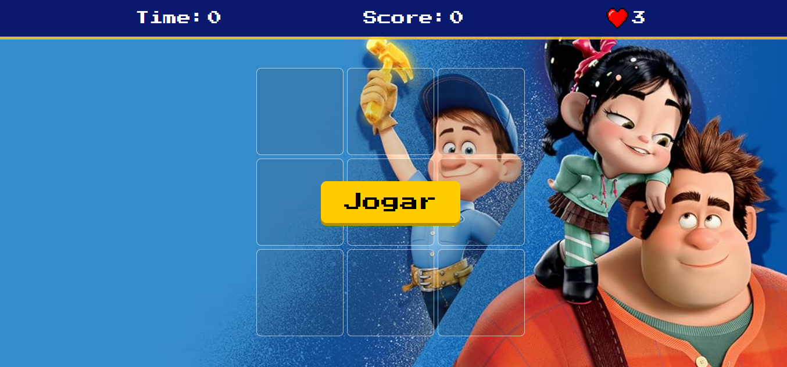

# Detona Ralph
🔨 Sobre o Projeto
Este é um jogo simples e divertido inspirado no clássico "Detona Ralph", onde o objetivo é clicar no personagem Ralph que aparece aleatoriamente em diferentes posições no painel. O jogo inclui um sistema de pontuação, um temporizador e um limite de vidas para tornar a jogabilidade mais desafiadora.

## Link para o jogo
<https://fbamorim.github.io/detona-ralph-jogo/>

## 🚀 Tecnologias Utilizadas
O projeto foi construído inteiramente com tecnologias web front-end padrão.

HTML5: Para a estrutura e marcação da página.

CSS3: Para o estilo e a responsividade do jogo.

JavaScript (ES6+): Para toda a lógica do jogo (movimentação, pontuação, tempo, vidas e eventos de clique).

## 🎮 Funcionalidades
Painel Interativo: O Ralph aparece em uma das 9 posições do painel.

Pontuação: A pontuação do jogador aumenta a cada clique bem-sucedido no Ralph.

Contagem Regressiva: O jogo tem um limite de tempo de 30 segundos.

Sistema de Vidas: O jogador tem 3 vidas. Clicar em um quadrado vazio resulta na perda de uma vida.

Game Over: O jogo termina quando o tempo acaba ou todas as vidas são perdidas.

Reinício do Jogo: Um botão "Jogar" permite iniciar um novo jogo, resetando a pontuação, o tempo e as vidas.

Responsividade: A interface se adapta a diferentes tamanhos de tela (computador, tablet e celular).
